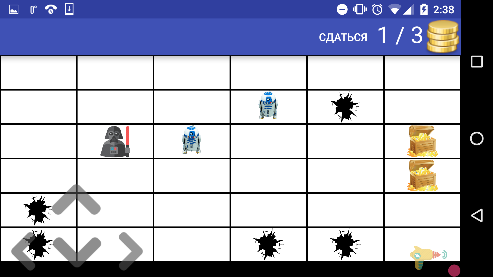
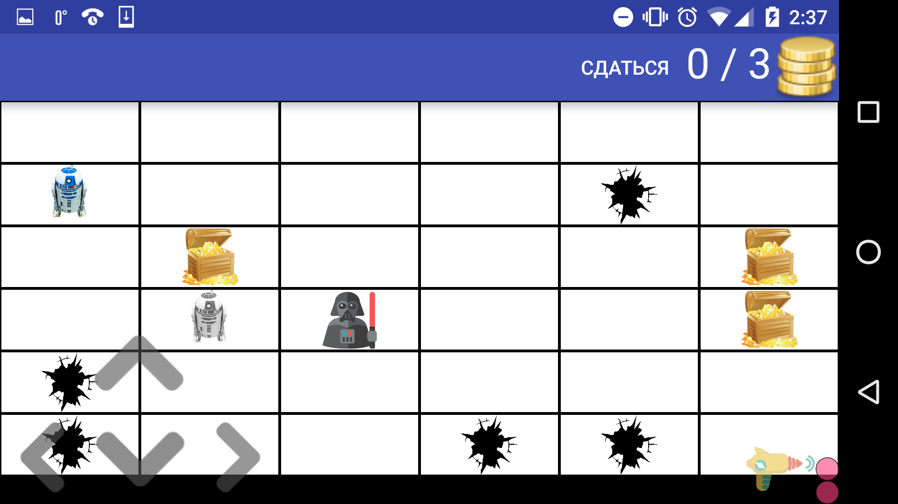
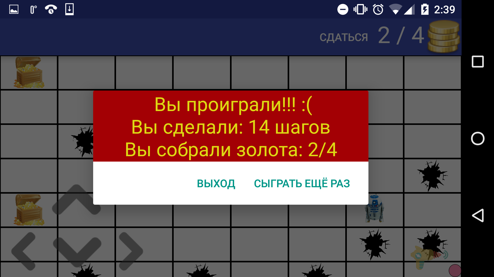
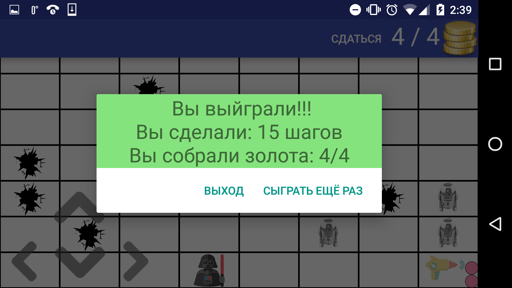

# StarGolds

StarGolds это увлекательная игра для Android 4.0.3 и выше.

Вы — алчный Дарт Вейдер, который хочет собрать всё золото из запасов повстанцев. Но на пути у вас стоит целая армия R2-D2, которых следует избегать. Ваша задача — пробраться по коридорам хранилища и собрать всё золото, не будучи пойманным роботами. Для того, чтобы собрать золото, вам необходимо встать на одну с ним клетку. Будьте осторожны: роботы пытаются вас догнать по кратчайшему пути, так что придётся пользоваться *бластером*.

> При применении бластера роботы, находящиеся на соседних с игроком клетках
по горизонтали, вертикали и диагонали, парализуются на 5 ходов. Но не тратьте заряды зря — их у вас всего 3!
> 

Также в комнате присутствуют ямы, на которые никто не может вставать.

## Генерация комнаты
Игрок перемещается по карте, характеристики которой задаёт перед началом игры. Комната генерируется таким образом, чтобы избежать возможных коллизий:

 * у игрока всегда есть путь до золота, как и в начале игры
 * в начале игры в радиусе 2-х клеток от игрока роботов нет;

Путь, по которому роботы догоняют игрока — всегда кратчайший; он строится по волновому алгоритму Ли.
После того, как игрок соберёт всё золото или встанет на одно клетку с роботом, игра заканчивается.

## Техническая часть

Для связывания всех Activities с Fragments, был применён паттерн « Фабричный метод».
> Метод «protected abstract Fragment createFragment();» описанные в абстрактном классе SingleFragmentActivity, переопределяется в классах потомках.

При разработке проекта, старался придерживаться принципам шаблонам разработки: Низкая связанность (Low Coupling) и Высокое зацепление (High Cohesion, разделяя проект на уровень Модель и Контроллер.

Были реализованы следующие классы:
 * Интерфейс основа на RecycleView widget.
> Необходимые для создание и отображения MapAdapter и MapItemViewHolder
 * Coordinate

> Положение объектов в двумерном массиве, с конвертированием  положения в RecycleView

* Map

> Хранение карты в целочисленном двумерном массиве.

> Все действий, связанные с передвижением роботов, игрока.

* MapGenerator 

> Исключающая коллизии, генерация карты.

> Поиск кратчайшего пути

* MapResizeDialogFragment

> Диалог невозможности создания карты без коллизий, или кол-во заданных объектов больше размерности карты 
     

